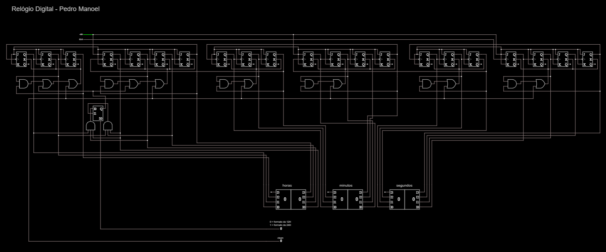
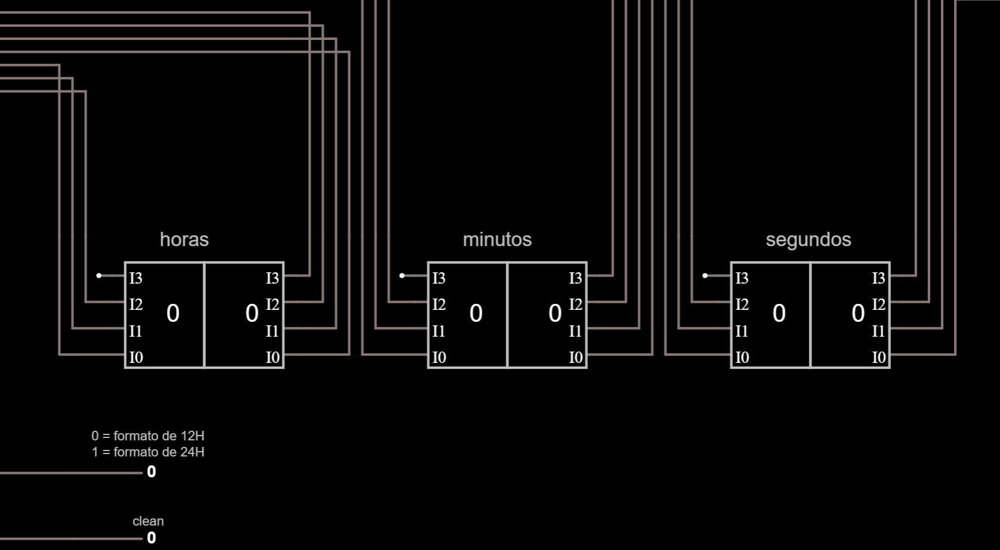
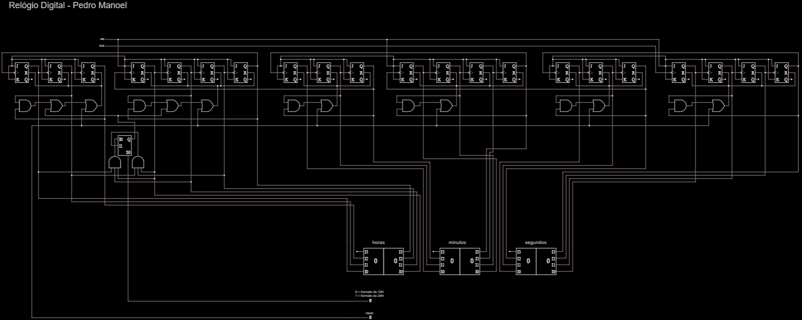
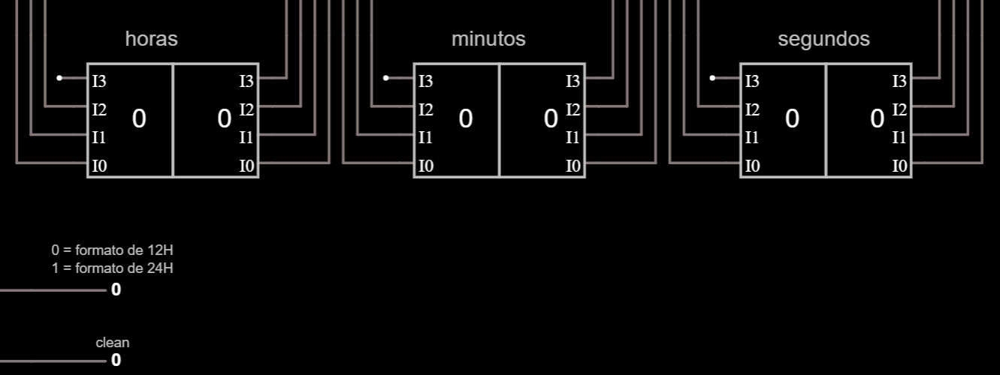

# ⌚ Relógio Digital

## 📝 Descrição

Construa um Relógio Digita com exibição de horas, minutos e segundos.

## 💡 Código

- [Relógio Digital](Relogio-Digital.txt)

## ⚡ Circuito

## ⚡ Circuito em execução

